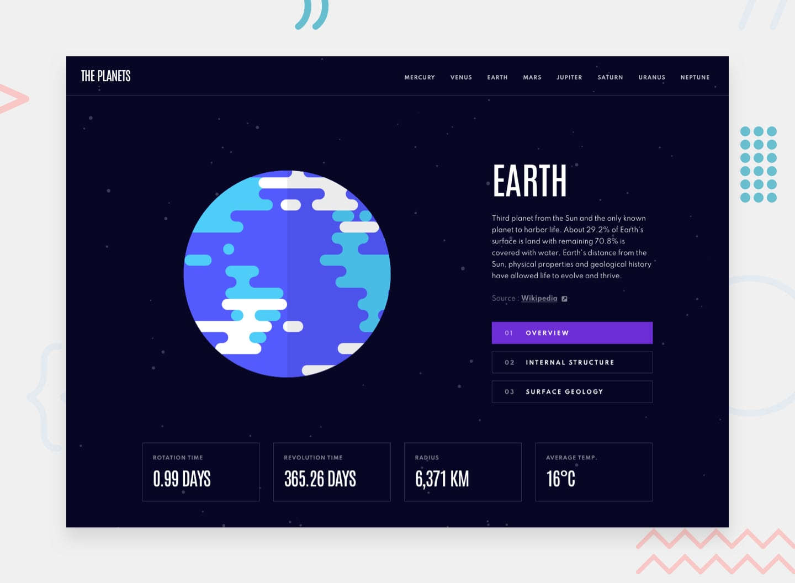

# Planets Fact Site



This is a solution to the [Planets fact site challenge on Frontend Mentor](https://www.frontendmentor.io/challenges/planets-fact-site-gazqN8w_f). Frontend Mentor challenges help you improve your coding skills by building realistic projects.

## Overview
The Planets Fact Site is a simple 8-page website about the solar system. It's built with Next.js and uses dynamic routing to serve unique content for each planet while maintaining high performance through static generation.

- [View Live Demo](https://planets-fact-site-delta-two.vercel.app/)

## Key Features
- **Dynamic Planet Routing:** Each planet has its own unique URL and metadata.

- **Three Different View:** Toggle between Overview, Internal Structure, and Surface Geology for every planet.

- **Responsive Layout:** Looks good on Mobile, Tablet, and Desktop.

- **Great for SEO:** Optimized SEO with unique page titles and descriptions for each planet.

- **Sharable Links:** Uses URL search parameters (?view=) to handle page states, so you can share specific views.

## Tech Stack
- **Framework:** Next.js 16 (App Router)

- **Styling:** Tailwind CSS

- **Language:** TypeScript

- **Deployment:** Vercel

## Architecture & Implementation
### Dynamic Static Generation
For lightning-fast load times, the project uses generateStaticParams. This tells Next.js to pre-render all 8 planet pages at build time.

```typescript
export function generateStaticParams() {
    const planets = ["mercury", "venus", "earth", "mars", "jupiter", "saturn", "uranus", "neptune"];
    return planets.map(planet => ({ planet }));
}
```
### Clean Code Structure
I kept things clean and organized by splitting the UI into device-specific components (`MobilePage`, `TabletPage`, and `DesktopPage`). This helps avoid messy prop drilling and makes it easier to fine-tune styles for each screen size.

### URL State Management
Instead of using local React useState, the “View” toggle is controlled through searchParams. This way, if a user refreshes the page while viewing the “Surface Geology” of Mars, they’ll land right back on that same view.

## Installation & Setup
**Clone the repository:**

```Bash
git clone https://github.com/your-username/planets-fact-site.git
```

**Install dependencies:**

```Bash
npm install
```
**Run the development server:**

```Bash
npm run dev
```
**Build for production:**

```Bash
npm run build
```

## Design Credits
Design challenge from [Frontend Mentor](https://www.frontendmentor.io/challenges/planets-fact-site-gazqN8w_f).

## Author

**GitHub:** @UloakuObi 

**Twitter:** @uloaku_obi
